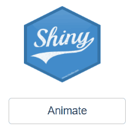

# shinyanimate

[](https://cran.r-project.org/package=shinyanimate)
[](https://cran.r-project.org/package=shinyanimate)

shinyanimate package is an R wrapper for [animate.css](https://daneden.github.io/animate.css/). It allows user to easily add animations to any UI element in shiny app using the elements id.

## Installation
To install the stable CRAN version: 
```r
install.packages("shinyanimate")
```


To install the latest development version from GitHub:
```r
library(devtools)
install_github('Swechhya/shinyanimate')
```

## Example code

### Add animation after event is observed:
```r
library(shiny)
library(shinyanimate)
ui <- fluidPage(
  withAnim(),
  div( id = 'shinyLogo', tags$img(src= "http://hexb.in/hexagons/shiny.png", width = "100px", height = "100px")),
  actionButton(inputId = "button", label = "Animate")
)
server <- function(input, output, session) {
  observeEvent(input$button,{
    startAnim(session, 'shinyLogo', 'shakeX')
  })
}
shinyApp(ui, server)
```


### Add animation on mouse hover:

```r
library(shiny)
library(shinyanimate)
ui <- fluidPage(
  withAnim(),
  div( id = 'shinyLogo', tags$img(src= "http://hexb.in/hexagons/shiny.png", width = "100px", height = "100px"))
)
server <- function(input, output, session) {
  observe(addHoverAnim(session, 'shinyLogo', 'pulse'))
}
shinyApp(ui, server)
```


### Add animation when the element comes into view after scrolling:
```r
library(shiny)
library(shinyanimate)
ui <- fluidPage(
    withAnim(),
    tags$h1('Scroll below to see an animation'),
    br(), br(), br(), br(), br(), br(), br(),
    br(), br(), br(), br(), br(), br(), br(),
    div( id = 'shinyLogo', tags$img(src= "http://hexb.in/hexagons/shiny.png", width = "100px", height = "100px"))
)
server <- function(input, output, session) {
    observe(addScrollAnim(session, 'shinyLogo', 'bounceInRight'))
}
shinyApp(ui, server)
```

